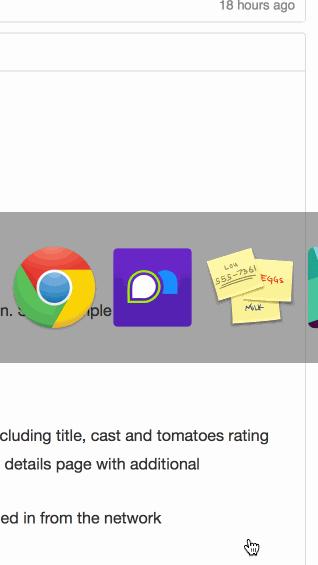

# Protip

First assignment for CodePath 2015s

Protip is a super basic tip calculator application

Installation:

Get XCode (Mac only). Clone the project, open in XCode and run. Super simple :)

Hours: 6

Completed Stories:

 * [x] Required: User can view a list of latest box office movies including title, cast and tomatoes rating
 * [x] Required: User can click on a movie in the list to bring up a details page with additional information such as synopsis
 * [x] Optional: Placeholder image is used for movie posters loaded in from the network

GIF walkthrough:

